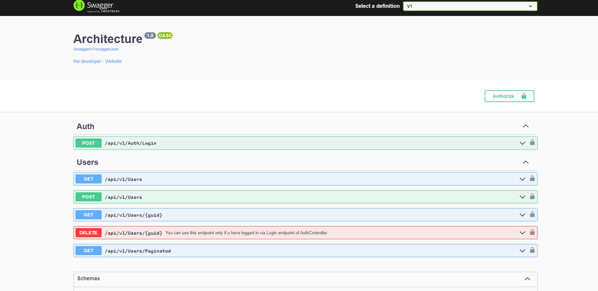
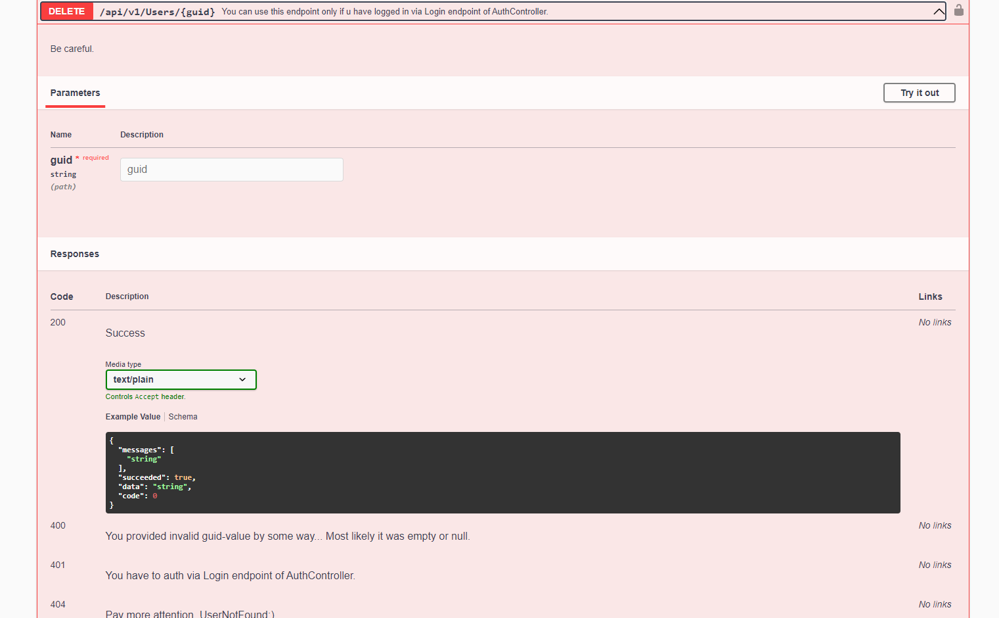
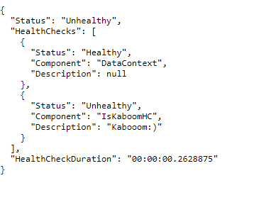

### Previews  
  
  
  
  
I've used here NLog, UnitOfWork w/ repositories, CQRS, architecture layers, Mediator, FluentValidation, AutoMapper,  
added api-versionin, bearer authorization, Docker.  
There are also watchdog-project checks health of services.  
  
### How to boot:  
External dependencies: .NET 7, ASP.NET 7, PostgreSQL.  
After installin, change connection string in appsettings.json of services.  
For usin Watchdog change url in it.  
  
### Troubleshootin  
If u have problem w/ Nuget packages just restore them by button in VS or command.